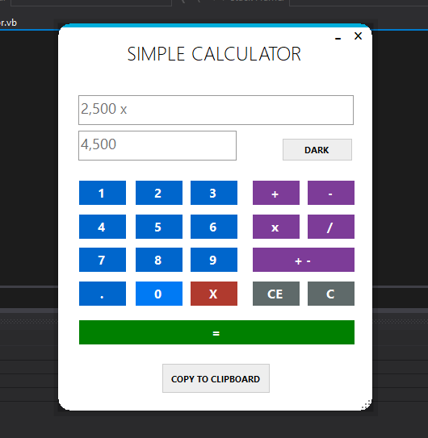

# MY SIMPLE CALCULATOR IN VB.NET

* Purpose: My Project
* Programming Language: Visual Basic.Net
* Version: VB 11.0
* Target Framework: .Net Framework 4.5
* IDE: MS Visual Studio 2012
* Type of Application: Desktop Application (Windows Forms)
* User Interface Design: Metro Framework
